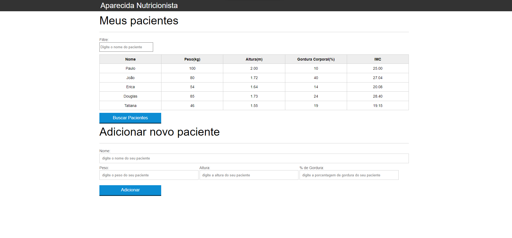

# Introducao Javascript - Calculadora de IMC

## :computer: Como acessar:

Para acessar o projeto [clique aqui!](https://letzc.github.io/Introducao-javascript/)

## 🛠️ Tecnologias usadas:
- 
- 
- 

## 📄 Sobre o projeto:
- Agradeço à Alura por todo o conhecimento compartilhado neste projeto guiado!
